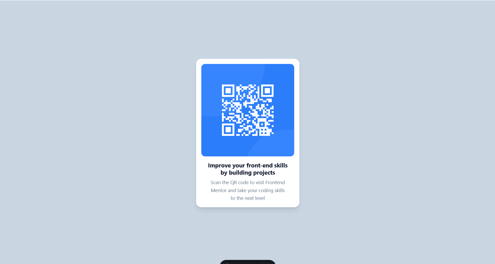

# 🧩 Proyecto: Componente QR Code

Este proyecto consiste en el desarrollo de un **componente de Código QR** utilizando **Astro** y **Tailwind CSS**.  
El objetivo es aplicar los conocimientos sobre **componentes**, **maquetación**, **estilos responsivos** y **utilidades CSS** para construir un diseño limpio, moderno y adaptable a diferentes dispositivos.

---

## 📖 Descripción general

### 🧩 Vista previa del proyecto

---

### 🔗 Enlaces del proyecto

- **Repositorio en GitHub:** [Repositorio](https://github.com/Kellyjudith/QR-Code-Component-)
- **Sitio desplegado (opcional):** [Vercel](https://qr-code-component-q3fx39zob-kellyjudiths-projects.vercel.app/)

---

## 🧠 Proceso de desarrollo

### 🛠️ Tecnologías utilizadas

- [Astro](https://astro.build)
- [Tailwind CSS](https://tailwindcss.com/)
- HTML5 semántico
- Diseño responsivo (Mobile-first)
- Componentes reutilizables

---

### 💡 Lo que aprendí
Durante el desarrollo de este proyecto reforcé varios conceptos importantes:

-Cómo crear y estructurar componentes en Astro.
-Uso de Tailwind CSS para aplicar estilos de forma rápida y eficiente.
-Manejo de rutas de archivos en Astro, especialmente con la carpeta public.
-Importancia de los estilos globales para que Tailwind funcione correctamente.
-Cómo replicar un diseño visual respetando detalles como espaciado, tipografía y alineación.

### 🚀 Áreas de mejora

Menciona aquí los aspectos que podrías mejorar o seguir practicando en futuros proyectos.

- Mejorar el manejo del responsive en pantallas pequeñas.  
-Explorar el uso de layouts en Astro para organizar mejor el proyecto.

---

### 📚 Recursos útiles

Incluye los enlaces, documentación o tutoriales que te ayudaron a completar este proyecto.

**Ejemplo:**
- [Documentación de Astro](https://docs.astro.build)  
- [Guía oficial de Tailwind CSS](https://tailwindcss.com/docs)  
- [MDN Web Docs - HTML y CSS](https://developer.mozilla.org/es/)  
- [Guía de diseño responsivo](https://web.dev/responsive-web-design-basics/)  

---

### 👩‍💻 Autor

- Nombre completo: Kelly Judith Salmeron Villalba
- Carrera: Ingenieria en tecnologias de la informacion y comunicaciones
- Grupo: 11 am 
- Correo institucional: 23151196@aguascalientes.tecnm.mx  

---

### ✨ Reflexión final

Este proyecto me permitió comprender mejor cómo integrar Astro con Tailwind CSS para crear interfaces modernas y responsivas.

Uno de los principales retos fue lograr que el diseño coincidiera visualmente con la referencia, especialmente en aspectos como el espaciado y el comportamiento del texto.

Lo que más disfruté fue ver cómo, a partir de una estructura básica en HTML, se puede construir un diseño limpio y profesional utilizando utilidades de Tailwind.

En futuros proyectos, aplicaré estos conocimientos para desarrollar interfaces más complejas y mejorar la organización de mis componentes.